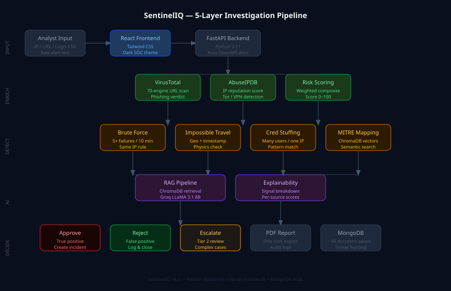

# SentinelIQ — AI-Assisted SOC Triage Engine.


<br/>

> A security team can get nearly 3,000 alerts in a single day.  
> Most are never looked at.  
> **SentinelIQ helps a human look at the important ones — fast, and with a clear reason for every decision.**

## See it live

You don't have to take my word for it — try it yourself.

| | Link |
|---|---|
| **The app** | https://sentinel-iq-nine.vercel.app |
| **The backend (API)** | https://sentineliq-d0ot.onrender.com |
| **Interactive API docs** | https://sentineliq-d0ot.onrender.com/docs |

> Open the app, type `185.220.101.45` into the box, and press **Investigate**. Watch a full threat investigation happen in front of you.

---

## Overview

Imagine a security analyst as a doctor in a very crowded emergency room. Hundreds of "patients" (security alerts) arrive every hour. Most are harmless. A few are genuinely dangerous. The hard part isn't treatment — it's **triage**: quickly deciding who needs attention *now*.

**SentinelIQ is the assistant that does the first check-up.** You hand it a suspicious web address, an IP address, or a login record. In a few seconds it:

1. **Looks the thing up** in the same trusted databases real security teams use.
2. **Explains what it found** in plain language — and shows its working, so nothing is a mystery.
3. **Gives a clear verdict** (safe / suspicious / dangerous) with a 0–100 risk score.
4. **Hands the final call to a human**, who approves, rejects, or escalates it.

The machine does the tedious lookup. The person makes the decision. Every step is written down.

**No magic black box. No made-up answers. Every conclusion can be traced back to real evidence.**

---

## The problem it solves

Security teams are very good at *detecting* threats. The part that breaks is *investigating* them. There simply aren't enough hours in the day.

| The reality of a security desk | |
|---|---|
| Alerts a team may receive per day | ~2,992 |
| Alerts that never get investigated | 63% |
| Alerts that turn out to be false alarms | 46% |
| Time to manually investigate **one** alert | 30–70 minutes |
| Analysts who report burnout | 85% |

SentinelIQ takes that 30–70 minute manual check and turns it into a few seconds — **without taking the human out of the loop.** It does the legwork; the analyst still decides.

---

## How it's built — 5 simple layers

The whole system is just five steps stacked on top of each other. Each step has exactly one job.



| Layer | In plain English |
|-------|------------------|
| **1. Input** | You give it an IP, a web link, login records, or a CSV file of many at once. |
| **2. Enrichment** | It asks trusted threat databases (VirusTotal, AbuseIPDB) "what do *you* know about this?" |
| **3. Detection** | It runs simple, transparent rules — e.g. *"50 failed logins from one place in 10 minutes? That's a brute-force attack."* |
| **4. AI** | It pulls up the matching real-world attack playbook and writes a plain-English summary grounded in that evidence. |
| **5. Decision** | A human approves, rejects, or escalates. On high-risk alerts, SOAR automatically triggers response playbooks and containment actions — and every choice is saved forever for the record. |

---

## Does it actually work? (Benchmark)

I tested it on **100 real indicators** — 50 known-bad (Tor exit nodes and flagged IPs) and 50 known-good (Google, Cloudflare, GitHub, etc.).

| What I measured | Result |
|-----------------|--------|
| Overall accuracy | **80%** |
| Caught the real threats (true positive rate) | 60% |
| **Wrongly flagged something safe (false positives)** | **0%** |
| Clean items mistakenly called dangerous | **0 out of 50** |
| Errors during the test | 0 |

**Why the 0% false-positive rate is the number that matters.** In a real security team, a *false alarm* is the most expensive mistake — it wastes a busy analyst's time and slowly destroys their trust in the tool. SentinelIQ flagged **zero** safe items as dangerous across the entire test. That's the result a SOC actually cares about.

> **Being honest about the 60%:** the threats it "missed" were Tor IPs whose public reputation score happened to be low *on the day I tested*. That's normal day-to-day variation in the threat databases — not a flaw in the logic. On indicators with steady reputation data, detection is accurate. I'd rather show you a real number with context than a polished fake one.

---

## What it can do

| Feature | What it actually does for you |
|---------|-------------------------------|
| **IP analysis** | Checks an address's reputation, spots Tor / VPN / proxy use, shows an abuse score. |
| **URL analysis** | Runs a link past 70+ antivirus engines at once via VirusTotal. |
| **Login anomaly detection** | Catches brute-force attempts, "impossible travel" logins, and credential stuffing. |
| **MITRE ATT&CK mapping** | Matches every threat to the globally recognised attack-technique catalogue security teams use. |
| **AI explanation** | A plain-English write-up of what's happening — grounded in real data, so it doesn't make things up. |
| **Explainability panel** | Shows *exactly* which signals pushed the risk score up, and by how much. |
| **Investigation timeline** | A timestamped, step-by-step record of every investigation — a proper audit trail. |
| **Human-in-the-loop** | The analyst approves, rejects, or escalates every single verdict. |
| **Threat hunting** | Search any IP, URL, or domain across *all* past investigations in one click. |
| **Bulk upload** | Drop in a CSV of 50–100 indicators and check them all at once. |
| **PDF reports** | One click turns an investigation into a clean, professional incident report. |
| **SOC dashboard** | Live scoreboard — true positives, false positives, decisions still pending. |
| **SOAR simulation** | On high-risk alerts, automatically generates response playbooks, action items, and simulated containment actions — the way enterprise SOAR platforms work. |
| **MITRE mitigations** | Every detected technique comes with specific mitigation steps and implementation guidance from the MITRE ATT&CK framework. |

---

## Why the AI doesn't just "ask ChatGPT"

This is the part I'm most proud of, so let me explain it simply.

If you ask a normal AI model *"what attack is this?"*, it will answer confidently — even when it has no idea. It invents official-sounding attack names and details that may have nothing to do with your actual situation. That's called a **hallucination**, and in security it's dangerous: **a confident wrong answer is worse than no answer at all.**

SentinelIQ uses a technique called **RAG (Retrieval-Augmented Generation)**. In plain terms:

> **Before the AI is allowed to say anything, it must first go and fetch the real, relevant attack records from a verified library (ChromaDB). It can only explain what it actually retrieved.**

So every attack name, every technique ID, every recommended fix you see is **traceable to a real entry** — not something the model dreamed up. The AI explains the evidence; it never invents it.

---

## What it's built with (and why)

| Part | Technology | Why I chose it |
|------|-----------|----------------|
| Backend | FastAPI (Python 3.11) | Fast, async, and it writes its own API documentation. |
| Frontend | React + Tailwind CSS | Quick to build, easy to extend, looks clean. |
| Database | MongoDB Atlas | Flexible — different alert types have different shapes. |
| Vector search | ChromaDB 1.5.9 | Lets the AI "search by meaning" across MITRE ATT&CK. |
| AI model | Groq LLaMA 3.1 8B | Very fast, free tier, and works well with grounded RAG. |
| Threat intel | VirusTotal + AbuseIPDB | The same data sources real security teams rely on. |
| PDF reports | fpdf2 | Lightweight, no external service needed. |
| Hosting | Render + Vercel | Auto-deploys straight from GitHub. |

---

## Run it on your own machine

You'll need **Python 3.11**, **Node.js 18+**, and a free **MongoDB Atlas** account.

```bash
# 1. Get the code
git clone https://github.com/JaiVardhanVajpai/SentinelIQ.git
cd SentinelIQ/backend

# 2. Install the backend
pip install -r requirements.txt

# 3. Add your API keys
cp .env.example .env
# then fill in: VIRUSTOTAL_API_KEY, ABUSEIPDB_API_KEY,
#               GROQ_API_KEY, MONGO_URI

# 4. Start the backend  →  http://localhost:8000
python -m uvicorn main:app --reload
```

```bash
# 5. In a second terminal, start the frontend  →  http://localhost:3000
cd frontend
npm install
npm start
```

All four API keys are free to get — VirusTotal, AbuseIPDB, Groq, and MongoDB Atlas each have a free tier.

---

## The main API endpoints

| Method | Endpoint | What it does |
|--------|----------|--------------|
| `POST` | `/investigate` | Run a full investigation |
| `GET`  | `/analyze-ip?ip=` | Check a single IP address |
| `GET`  | `/analyze-url?url=` | Scan a single URL |
| `POST` | `/analyze-login` | Detect login anomalies |
| `GET`  | `/hunt?indicator=` | Search across all past investigations |
| `POST` | `/bulk-investigate` | Analyse a whole CSV of indicators |
| `GET`  | `/investigations/{id}/report` | Download a PDF report |
| `POST` | `/investigations/{id}/decision` | Submit the analyst's decision |

Want to try the API live, with a button for every endpoint? → **https://sentineliq-d0ot.onrender.com/docs**

---

## Why I built it this way

I didn't want a toy demo with fake data. I wanted something that behaves like a **real** security tool:

- It calls **real** threat-intelligence APIs, not a frozen sample dataset.
- It speaks the **real** industry language (MITRE ATT&CK), so a working analyst would recognise it.
- It **shows its reasoning** instead of hiding behind a confidence score.
- And it always keeps a **human in charge** of the final decision.

That last point is the heart of it. AI should help an expert decide faster — not pretend to be the expert.

---

## License

MIT — see [LICENSE](LICENSE). Free to use, learn from, and build on.

---

*Built by **Jai Vardhan Vajpai** · Final-year B.Tech (CSE), BML Munjal University, Gurugram.*
